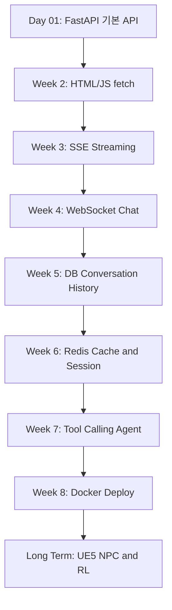
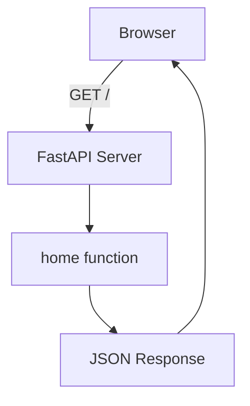
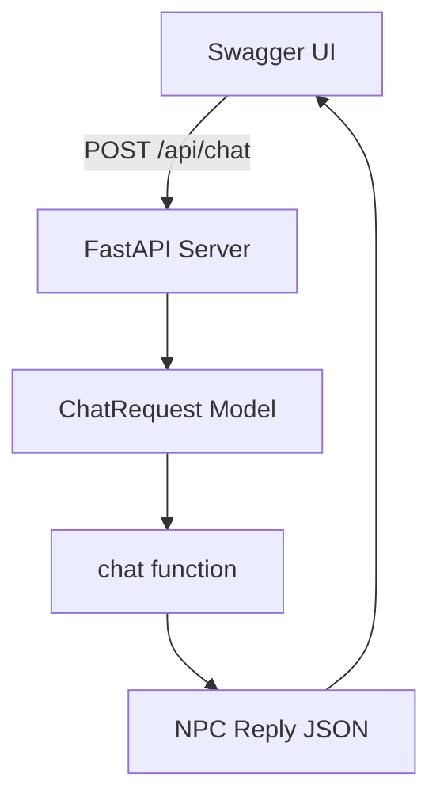

# 밍밍이 AI 개발 커리어 로드맵 (2026)

## 목적

이 문서는 프론트엔드/백엔드 기초가 조각난 상태에서, AI 커리어를 유지하고 확장하기 위해 어떤 순서로 공부하고 구현할지 정리한 실행용 로드맵이다.

핵심 목표는 강의를 많이 보는 것이 아니라, 하나의 프로젝트를 점점 진화시키면서 웹 구조, API, DB, 스트리밍, Agent, Docker, 운영 감각을 연결하는 것이다.

중심 프로젝트:

> AI NPC / 음성 챗봇 백엔드

---

# 0. 현재 상황

## 강점

- 게임 디자이너 출신
- 순수미술(MFA) 배경
- 비전공 개발자
- AI 도구를 활용한 바이브 코딩 경험 다수
- UE5 기반 게임 AI 개발 경험
- LoRA 및 LLM 파인튜닝 경험
- RL(강화학습) 기반 몬스터 AI 연구 진행 중
- FastAPI 기반 AI 서비스 개발 경험
- ComfyUI, 음성 AI, 생성형 AI 파이프라인 구축 경험
- 실제 회사에서 AI 개발 업무 수행 중

## 약점

- 백엔드 기초 지식 부족
- HTTP / REST API 개념 약함
- async/await 이해 부족
- 프론트엔드와 백엔드가 어떻게 대화하는지 감각 부족
- DB 설계 경험 부족
- Redis 사용 경험 부족
- Docker 및 Linux 운영 경험 부족
- 시스템 설계 이해도 부족

## 핵심 판단

기초가 아예 없는 것이 아니라, 실무에서 만진 조각들이 아직 연결되지 않은 상태다.

따라서 처음부터 CS 전공 커리큘럼을 타는 것보다, 이미 해본 AI 서비스 경험을 바탕으로 웹/백엔드 구조를 다시 연결하는 방식이 적합하다.

---

# 1. 학습 루프

매 주차는 아래 순서로 진행한다.

```txt
YouTube overview -> 다이어그램 구조화 -> 실제 구현 -> 회고 정리
```

## YouTube

목적은 전체 그림을 빠르게 잡는 것이다.

- 주차 시작 전에 10~30분 이내로 1개만 본다.
- 막힌 개념이 있을 때만 추가로 1개 더 본다.
- 강의 정주행, 튜토리얼 수집, 클론코딩 무한 반복은 금지한다.

## 다이어그램

목적은 머릿속 구조를 눈에 보이게 만드는 것이다.

- 처음 이해할 때: Excalidraw
- 최종 정리할 때: Mermaid
- 나중에 교재/블로그/포트폴리오로 만들 때: HTML 인터랙티브 노트

## 실제 구현

목적은 개념을 몸에 붙이는 것이다.

- 매 주차마다 작게라도 실행되는 결과물을 만든다.
- 새 프로젝트를 계속 만들지 않고, `AI NPC 채팅 서버`를 점점 진화시킨다.

## 회고

구현하고 "돌아간다"에서 끝내지 않는다.

각 Day 또는 미니 구현이 끝날 때 아래 질문에 답한다.

```md
# Day N 회고

## 오늘 만든 것

## 오늘 이해한 개념

## 막힌 부분

## AI가 짠 코드 중 내가 설명할 수 있는 부분

## 아직 설명 못 하는 부분

## 이게 실제 AI 서비스에서 쓰이는 곳

## 다음에 고칠 점
```

---

# 2. 학습 우선순위와 비중

| 우선순위 | 주제 | YouTube | 다이어그램 | 구현 |
|---|---|---:|---:|---:|
| 1순위 | 백엔드 기초 | 30% | 20% | 50% |
| 2순위 | DB / Redis | 20% | 40% | 40% |
| 3순위 | Agent 시스템 | 30% | 30% | 40% |
| 4순위 | Linux / Docker | 20% | 10% | 70% |
| 5순위 | RL / 게임 AI | 40% | 30% | 30% |

---

# 3. 8주 커리큘럼

## Week 1. FastAPI와 API 감각 잡기

목표:

- API가 무엇인지 이해한다.
- 브라우저와 서버가 요청/응답으로 대화한다는 감각을 만든다.
- Swagger에서 보던 `GET /users`, `POST /chat`이 실제 서버 함수와 연결된다는 것을 이해한다.

학습 항목:

- API
- HTTP
- GET / POST
- FastAPI
- Swagger docs
- JSON

결과물:

- `/` 기본 API
- `/api/message` API
- `/api/npc` API
- `/api/chat` POST API
- Swagger 테스트
- Day 01 회고 md
- Excalidraw 흐름도 1개

## Week 2. 프론트에서 백엔드 호출하기

목표:

- 순수 HTML/JS에서 FastAPI를 호출한다.
- `fetch()`가 무엇인지 이해한다.
- 프론트엔드와 백엔드가 API로 대화한다는 것을 체감한다.

학습 항목:

- HTML
- CSS
- JavaScript 기초
- DOM
- fetch
- CORS

결과물:

- 간단한 채팅 UI
- 버튼 클릭 -> FastAPI API 호출
- 응답을 화면에 출력

주의:

- React, Next.js는 아직 하지 않는다.
- Week 2는 순수 HTML/CSS/JS로 충분하다.

## Week 3. SSE 스트리밍

목표:

- AI 응답이 한 번에 오는 것이 아니라 조금씩 흘러오는 구조를 이해한다.
- SSE를 사용해 브라우저에 스트리밍 응답을 보여준다.

학습 항목:

- StreamingResponse
- SSE(Server Sent Events)
- EventSource
- 토큰 스트리밍 개념

결과물:

- `/api/stream` API
- 브라우저에서 한 글자씩 출력되는 AI 응답 흉내

## Week 4. WebSocket 실시간 채팅

목표:

- HTTP 요청/응답과 WebSocket의 차이를 이해한다.
- 실시간 NPC 채팅 구조를 만든다.

학습 항목:

- WebSocket
- 연결 유지
- 실시간 메시지
- HTTP와 WebSocket 차이

결과물:

- `/ws/chat` WebSocket 엔드포인트
- 간단한 실시간 채팅 UI

## Week 5. DB에 대화 기록 저장

목표:

- 대화 기록을 DB에 저장한다.
- 데이터가 메모리에 있을 때와 DB에 있을 때의 차이를 이해한다.

학습 항목:

- SQLite
- PostgreSQL 맛보기
- Table
- Row
- CRUD
- Index
- Transaction

결과물:

- 대화 저장
- 대화 목록 조회
- 특정 NPC의 대화 기록 조회

주의:

- 처음부터 PostgreSQL로 무겁게 가지 않는다.
- SQLite로 흐름을 잡고, 이후 PostgreSQL로 확장한다.

## Week 6. Redis 캐시와 세션

목표:

- Redis가 왜 필요한지 이해한다.
- 캐시, TTL, 세션 개념을 AI 서비스와 연결한다.

학습 항목:

- Redis
- Cache
- TTL
- Session
- Rate limit 기초

결과물:

- 같은 질문이면 캐시된 응답 반환
- NPC별 임시 상태 저장

주의:

- 설치가 막히면 개념과 의사 코드 먼저 정리한다.
- 실제 Redis 실행은 Docker 주차와 묶어서 처리해도 된다.

## Week 7. Tool Calling Agent

목표:

- LLM이 단순 답변이 아니라 실제 행동을 하게 만든다.
- Agent 구조의 기본 감각을 만든다.

학습 항목:

- Tool Calling
- Agent
- Memory
- Workflow
- Evaluation 기초

결과물:

- NPC가 도구를 호출하는 구조
- 예: 아이템 조회 흉내, NPC 상태 조회 흉내, DB 검색 흉내

주의:

- 처음부터 실제 외부 API를 붙이지 않는다.
- `get_npc_status()`, `search_item()` 같은 가짜 tool 함수로 구조를 먼저 익힌다.

## Week 8. Docker와 배포 감각

목표:

- 로컬에서만 도는 프로젝트를 서버에서 실행 가능한 형태로 만든다.
- Docker, 환경변수, 로그 확인을 경험한다.

학습 항목:

- Dockerfile
- docker compose
- `.env`
- Linux 기본 명령어
- 로그 확인
- 포트 개념

결과물:

- FastAPI 서버 Docker 실행
- DB/Redis 포함 docker compose 구성
- README 실행 방법 작성

---

# 4. 프로젝트 진화 구조



---

# 5. Day 01 실행 계획

## Day 01 목표

오늘 목표는 백엔드 전체를 이해하는 것이 아니다.

목표는 딱 하나다.

> FastAPI 서버를 띄우고, 브라우저와 Swagger에서 API를 직접 호출해본다.

Day 01에서 이해해야 하는 개념은 다음 5개다.

1. 서버는 요청을 기다리는 프로그램이다.
2. 브라우저는 서버에게 요청을 보낸다.
3. API는 프로그램끼리 대화하는 창구다.
4. FastAPI는 파이썬으로 API 서버를 만드는 도구다.
5. Swagger는 내가 만든 API 목록을 보여주는 자동 문서다.

## Day 01-1. 프로젝트 폴더 만들기

폴더명:

```txt
ai-npc-backend-lab
```

추천 구조:

```txt
ai-npc-backend-lab/
  README.md
  day01/
    main.py
    notes_template.md
```

## Day 01-2. FastAPI 설치

터미널에서 실행:

```bash
pip install fastapi uvicorn
```

이때 이해할 것:

- `fastapi`: API 서버를 만드는 파이썬 프레임워크
- `uvicorn`: FastAPI 앱을 실제로 실행해주는 서버 실행기

정리 문장:

> FastAPI는 앱을 만드는 도구고, uvicorn은 그 앱을 켜주는 실행기다.

## Day 01-3. 가장 작은 API 만들기

`day01/main.py`

```python
from fastapi import FastAPI

app = FastAPI()

@app.get("/")
def home():
    return {"message": "안녕 밍밍이"}
```

이 코드에서 이해할 것:

- `from fastapi import FastAPI`: FastAPI 도구를 가져온다.
- `app = FastAPI()`: API 서버 앱을 만든다.
- `@app.get("/")`: 누가 `/` 주소로 GET 요청을 보내면 아래 함수를 실행하라는 뜻이다.
- `def home()`: 실제로 실행될 함수다.
- `return {"message": "안녕 밍밍이"}`: 브라우저에게 JSON 응답을 돌려준다.

## Day 01-4. 서버 실행하기

`day01` 폴더에서 실행:

```bash
uvicorn main:app --reload
```

이 명령어 뜻:

```txt
uvicorn = 서버 실행기
main = main.py 파일
app = main.py 안에 있는 FastAPI 앱 변수
--reload = 코드 바꾸면 자동 재시작
```

브라우저에서 접속:

```txt
http://127.0.0.1:8000
```

성공 기준:

```json
{"message":"안녕 밍밍이"}
```

## Day 01-5. Swagger 확인하기

브라우저에서 접속:

```txt
http://127.0.0.1:8000/docs
```

여기서 확인할 것:

- `GET /`가 자동으로 생겨 있는지
- `Try it out` 버튼이 있는지
- `Execute`를 누르면 응답이 나오는지

이해할 것:

> Swagger는 내가 만든 API 목록과 테스트 버튼을 자동으로 보여주는 문서다.

## Day 01-6. API 하나 더 만들기

`main.py`에 추가:

```python
@app.get("/api/npc")
def get_npc():
    return {
        "name": "슬라임",
        "hp": 100,
        "mood": "friendly",
    }
```

접속:

```txt
http://127.0.0.1:8000/api/npc
```

이해할 것:

- `/`와 `/api/npc`는 서로 다른 API 주소다.
- 주소가 다르면 실행되는 함수도 다르다.
- 서버는 요청 주소를 보고 어떤 함수를 실행할지 결정한다.

## Day 01-7. POST API 맛보기

`main.py`에 추가:

```python
from pydantic import BaseModel

class ChatRequest(BaseModel):
    message: str

@app.post("/api/chat")
def chat(request: ChatRequest):
    return {
        "user_message": request.message,
        "npc_reply": f"NPC가 들었어: {request.message}",
    }
```

Swagger에서 `/api/chat`을 열고 `Try it out`을 누른 뒤 아래 JSON 입력:

```json
{
  "message": "안녕 NPC"
}
```

예상 응답:

```json
{
  "user_message": "안녕 NPC",
  "npc_reply": "NPC가 들었어: 안녕 NPC"
}
```

이해할 것:

- GET은 주로 데이터를 가져올 때 쓴다.
- POST는 주로 데이터를 보낼 때 쓴다.
- 채팅 메시지는 서버에 보내는 데이터이므로 POST가 어울린다.
- `BaseModel`은 요청 JSON의 모양을 정하는 도구다.

## Day 01 최종 main.py

```python
from fastapi import FastAPI
from pydantic import BaseModel

app = FastAPI()


@app.get("/")
def home():
    return {"message": "안녕 밍밍이"}


@app.get("/api/npc")
def get_npc():
    return {
        "name": "슬라임",
        "hp": 100,
        "mood": "friendly",
    }


class ChatRequest(BaseModel):
    message: str


@app.post("/api/chat")
def chat(request: ChatRequest):
    return {
        "user_message": request.message,
        "npc_reply": f"NPC가 들었어: {request.message}",
    }
```

## Day 01 Excalidraw로 그릴 그림

첫 번째 그림:

```txt
브라우저
  ↓ GET /
FastAPI 서버
  ↓ home() 함수 실행
JSON 응답
  ↓
브라우저에 표시
```

두 번째 그림:

```txt
Swagger
  ↓ POST /api/chat
FastAPI 서버
  ↓ chat() 함수 실행
request.message 읽기
  ↓
NPC 응답 JSON 반환
```

## Day 01 Mermaid 정리

`README.md` 또는 `day01/notes_template.md`에 아래를 붙인다.





## Day 01 회고 질문

`day01/notes_template.md`에 아래 질문에 답한다.

```md
# Day 01 회고

## 오늘 만든 것

## FastAPI는 무엇인가?

## API는 무엇인가?

## GET / 는 어떤 함수와 연결됐는가?

## POST /api/chat은 왜 POST인가?

## Swagger에서 본 것은 무엇인가?

## 아직 헷갈리는 것

## 이 구조가 AI NPC 서비스에서 어디에 쓰이는가?
```

## Day 01 성공 기준

Day 01은 아래가 되면 성공이다.

- `uvicorn main:app --reload`로 서버 실행 가능
- 브라우저에서 `/` 접속 가능
- `/docs`에서 Swagger 확인 가능
- `GET /api/npc` 테스트 가능
- `POST /api/chat`에 JSON을 보내고 응답 확인 가능
- Excalidraw 흐름도 1개 이상 그림
- notes 작성

Day 01에서 하지 말 것:

- React 붙이기
- Next.js 붙이기
- Docker 붙이기
- DB 붙이기
- 인증 붙이기
- LangChain 붙이기
- MCP 붙이기
- 갑자기 Agent 만들기

---

# 6. 하지 말아야 할 것

현재 시점에서 우선순위가 낮은 것:

- 새로운 LLM 모델 비교
- 프롬프트 엔지니어링 집착
- 챗봇 또 만들기
- LangChain 튜토리얼 무한 반복
- 수학책 정독
- React / Next.js를 초반부터 깊게 파기
- Docker, DB, Redis를 Day 01에 같이 붙이기

---

# 7. 최종 목표

**현재**

AI 기능 개발자

↓

**중기**

AI 시스템 개발자

↓

**장기**

게임 AI 엔지니어

특히

> "UE5 + RL + 생성형 AI + 게임디자인"

을 결합한 희소한 포지션을 목표로 한다.
