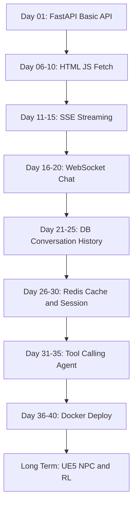

# Basic Fast AI

비전공 AI 개발자가 `AI 기능 개발자`에서 `AI 시스템 개발자`로 성장하기 위한 실습형 백엔드 커리큘럼입니다.

중심 프로젝트는 하나입니다.

> AI NPC / 음성 챗봇 백엔드

매번 새 프로젝트를 만들지 않고, 작은 FastAPI 서버에서 시작해 API, 프론트 연동, 스트리밍, WebSocket, DB, Redis, Agent, Docker까지 차례대로 붙입니다.

---

## 학습 루프

각 Day는 아래 순서로 진행합니다.

```txt
YouTube overview -> 다이어그램 구조화 -> 실제 구현 -> 회고 정리
```

- YouTube: 개념을 빠르게 잡는 용도, 10~30분 안에서 제한
- Excalidraw: 처음 이해할 때 손그림으로 구조화
- Mermaid: README, 회고, 포트폴리오용 최종 정리
- 구현: 작게라도 실행되는 결과물을 만들기
- 회고: 내가 설명할 수 있는 코드와 아직 헷갈리는 부분을 기록

---

## Day 기준 커리큘럼

| Day | 주제 | 목표 | 결과물 |
|---:|---|---|---|
| 01 | FastAPI 첫 API | 서버를 켜고 API를 직접 호출한다 | `GET /`, `GET /api/npc`, `POST /api/chat` |
| 02 | HTTP와 요청/응답 | 브라우저와 서버가 어떻게 대화하는지 이해한다 | 요청/응답 흐름도, API 호출 실습 |
| 03 | GET / POST 정리 | 데이터를 가져오는 요청과 보내는 요청을 구분한다 | NPC 조회 API, 채팅 POST API 개선 |
| 04 | JSON과 Pydantic | 요청/응답 데이터 모양을 이해한다 | Request/Response 모델 분리 |
| 05 | Day 01~04 복습 | API 서버의 기본 구조를 설명할 수 있게 만든다 | 회고 문서, Mermaid API 흐름도 |
| 06 | HTML 기본 | 브라우저 화면의 구조를 만든다 | 간단한 채팅 화면 HTML |
| 07 | CSS 기본 | 화면을 읽기 좋게 정리한다 | 채팅 UI 스타일링 |
| 08 | JavaScript DOM | 버튼 클릭과 화면 변경을 이해한다 | 버튼 클릭 시 메시지 추가 |
| 09 | fetch | 프론트에서 FastAPI를 호출한다 | 채팅 UI -> `/api/chat` 호출 |
| 10 | CORS와 분리 구조 | 프론트/백엔드가 분리될 때 생기는 문제를 이해한다 | CORS 설정, 구조도 정리 |
| 11 | Streaming 개념 | AI 응답이 조금씩 오는 구조를 이해한다 | 스트리밍 흐름도 |
| 12 | SSE 기본 | 서버에서 이벤트를 흘려보낸다 | `/api/stream` 엔드포인트 |
| 13 | EventSource | 브라우저에서 SSE를 받는다 | 한 글자씩 출력되는 UI |
| 14 | 스트리밍 UI 정리 | AI 채팅처럼 보이는 흐름을 만든다 | 스트리밍 채팅 화면 |
| 15 | SSE 복습 | HTTP 응답과 스트리밍 응답 차이를 설명한다 | 회고 문서, Mermaid SSE 흐름도 |
| 16 | WebSocket 개념 | 연결을 유지하는 통신을 이해한다 | HTTP vs WebSocket 비교표 |
| 17 | WebSocket 서버 | FastAPI WebSocket 엔드포인트를 만든다 | `/ws/chat` |
| 18 | WebSocket 클라이언트 | 브라우저에서 WebSocket에 연결한다 | 실시간 메시지 UI |
| 19 | NPC 채팅 구조 | 연결된 사용자와 NPC 응답 흐름을 정리한다 | 간단한 실시간 NPC 채팅 |
| 20 | WebSocket 복습 | 실시간 기능의 장단점을 설명한다 | 회고 문서, WebSocket 흐름도 |
| 21 | DB 기본 | 메모리 저장과 DB 저장의 차이를 이해한다 | DB 개념 정리 |
| 22 | SQLite 시작 | 작은 로컬 DB를 붙인다 | SQLite 연결 |
| 23 | 대화 저장 | 채팅 메시지를 DB에 저장한다 | conversations 테이블 |
| 24 | 대화 조회 | 저장된 대화를 API로 조회한다 | 대화 목록/상세 조회 API |
| 25 | Index / Transaction | DB 성능과 안전성의 기본을 이해한다 | ERD, 인덱스 메모 |
| 26 | Redis 개념 | 캐시와 세션이 왜 필요한지 이해한다 | Redis 사용 지점 다이어그램 |
| 27 | 캐시 구조 | 같은 질문에 캐시 응답을 돌려준다 | 간단한 캐시 레이어 |
| 28 | TTL / 세션 | 임시 상태가 사라지는 구조를 이해한다 | NPC 상태 저장 실습 |
| 29 | Rate limit 맛보기 | 요청 제한의 필요성을 이해한다 | 간단한 요청 제한 의사 코드 |
| 30 | DB/Redis 복습 | 저장소와 캐시의 역할을 구분한다 | 회고 문서, 저장 구조도 |
| 31 | Tool Calling 개념 | LLM이 도구를 호출하는 구조를 이해한다 | Agent 흐름도 |
| 32 | 가짜 Tool 만들기 | 외부 API 없이 tool 함수를 만든다 | `get_npc_status()`, `search_item()` |
| 33 | Tool Router | 사용자 요청에 따라 tool을 고른다 | 간단한 tool 선택 로직 |
| 34 | Memory 구조 | 대화 기록을 Agent 판단에 활용한다 | DB 기반 memory 조회 |
| 35 | Agent 복습 | 답변하는 AI와 행동하는 AI를 구분한다 | 회고 문서, Agent 구조도 |
| 36 | Docker 개념 | 로컬 실행과 컨테이너 실행의 차이를 이해한다 | Docker 개념 정리 |
| 37 | Dockerfile | FastAPI 서버를 이미지로 만든다 | `Dockerfile` |
| 38 | docker compose | 서버, DB, Redis를 함께 실행한다 | `docker-compose.yml` |
| 39 | env / log | 환경변수와 로그 확인을 경험한다 | `.env.example`, 로그 확인 메모 |
| 40 | 최종 정리 | 프로젝트를 실행 가능한 포트폴리오 형태로 정리한다 | README 실행법, 최종 회고 |

---

## 프로젝트 진화 구조



---

## Day 01 목표

Day 01은 백엔드 전체를 이해하는 날이 아닙니다.

목표는 딱 하나입니다.

> FastAPI 서버를 띄우고, 브라우저와 Swagger에서 API를 직접 호출해본다.

Day 01에서 이해할 개념:

1. 서버는 요청을 기다리는 프로그램이다.
2. 브라우저는 서버에게 요청을 보낸다.
3. API는 프로그램끼리 대화하는 창구다.
4. FastAPI는 파이썬으로 API 서버를 만드는 도구다.
5. Swagger는 내가 만든 API 목록을 보여주는 자동 문서다.

추천 구조:

```txt
ai-npc-backend-lab/
  README.md
  day01/
    main.py
    notes_template.md
```

Day 01 성공 기준:

- `uvicorn main:app --reload`로 서버 실행 가능
- 브라우저에서 `/` 접속 가능
- `/docs`에서 Swagger 확인 가능
- `GET /api/npc` 테스트 가능
- `POST /api/chat`에 JSON을 보내고 응답 확인 가능
- Excalidraw 흐름도 1개 이상 작성
- 회고 작성

---

## 참고 문서

- [2026 밍밍이 커리큘럼 로드맵.md](./2026%20밍밍이%20커리큘럼%20로드맵.md)
- [프론트엔드 기본 지식.md](./1_%EB%B9%84%EA%B0%9C%EB%B0%9C%EC%9E%90%20%EB%B0%94%EC%9D%B4%EB%B8%8C%EC%BD%94%EB%8D%94%EB%A5%BC%20%EC%9C%84%ED%95%B4%20%EB%A7%8C%EB%93%A0,%20%EA%B0%80%EB%B3%8D%EA%B2%8C%20%EB%93%A4%EC%96%B4%EB%8F%84%20%EA%B9%8A%EA%B2%8C%20%EB%82%A8%EB%8A%94%20%ED%94%84%EB%A1%A0%ED%8A%B8%EC%97%94%EB%93%9C%20%EA%B8%B0%EB%B3%B8%20%EC%A7%80%EC%8B%9D.md)

---

## 하지 말 것

- 초반부터 React / Next.js 붙이기
- Day 01에 DB, Redis, Docker까지 한 번에 붙이기
- LangChain 튜토리얼만 반복하기
- 프롬프트 엔지니어링만 파기
- 돌아가는 코드를 설명하지 못한 채 다음 단계로 넘어가기
